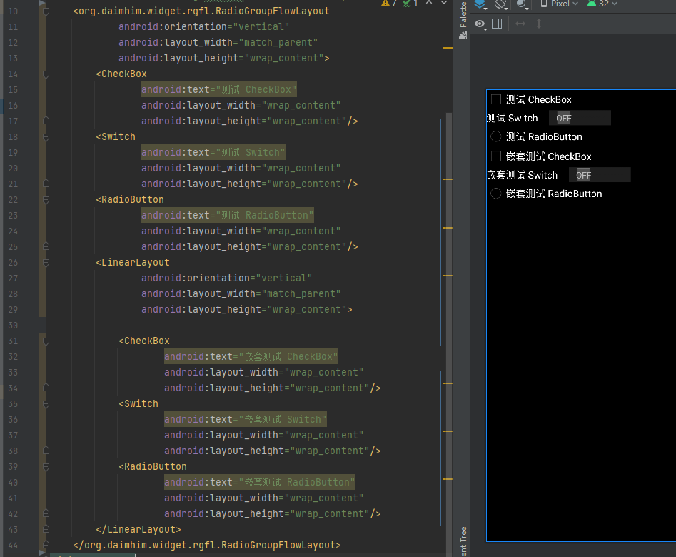

# 版本更新说明
##### 1.0.2
> 1. 初始化项目
# 多嵌套、多子类选择器
##### 项目简介
> 本项目扩展了RadioGroup的功能，保留了原本的单选功能。原内部子控件仅支持RadioButton，现在支持CheckBox、RadioButton、Switch、ToggleButton等CompoundButton子类的所有控件。可以混合使用。不仅如此原本RadioGroup仅识别一层控件，现在即使嵌套多层也能一同联动
##### 接入指南
###### 1. 依赖

```
// 根目录配置仓库
repositories {
        maven { url "https://jitpack.io" }
    }
// 模块下 引入依赖
dependencies {
    implementation 'com.github.Daimhim:RadioGroupFlowLayout:1.0.2'
}
```

###### 2. 使用



###### 详细文档或者后续更新都会在下面链接
[RadioGroupFlowLayout](http://note.youdao.com/noteshare?id=8624ff958de76d101b80e2463be678c0&sub=23998F4C67D049008788EC08C9F8CA67)